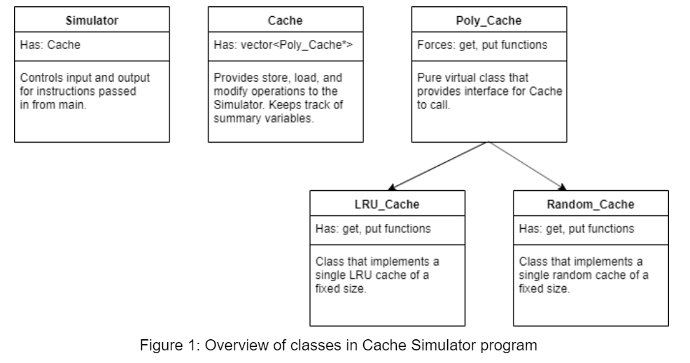
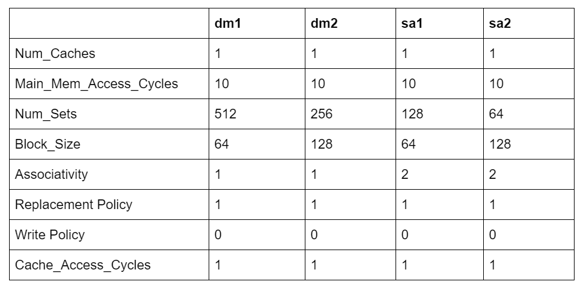
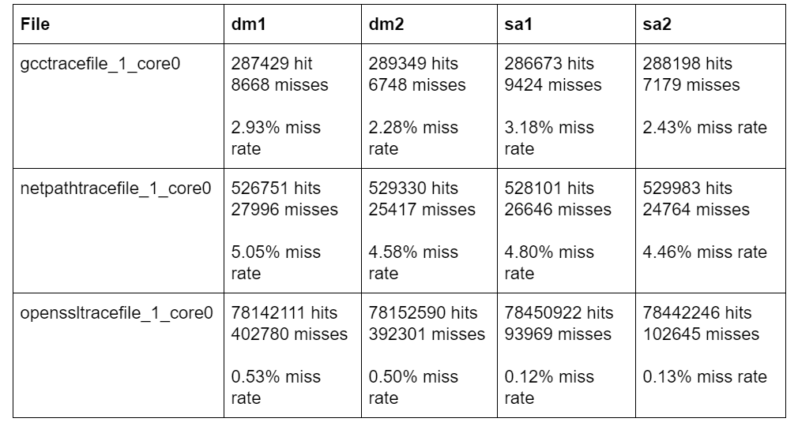
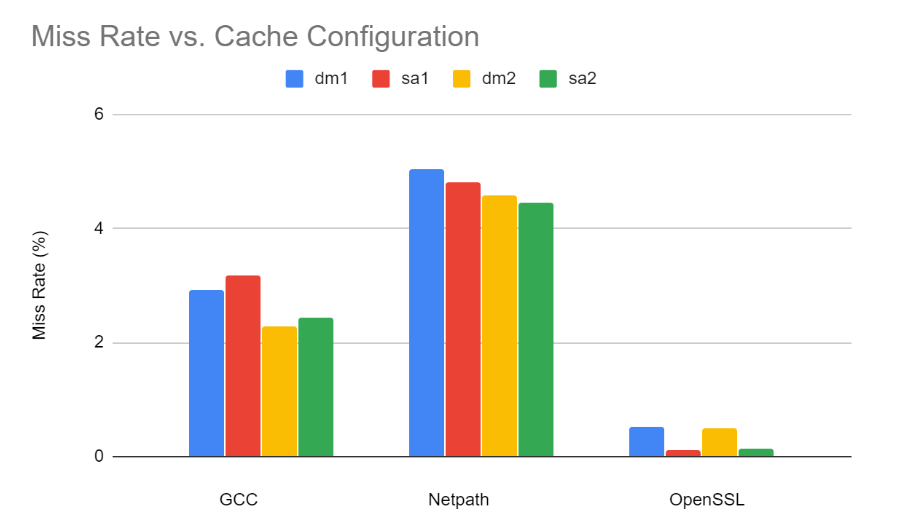

# cache_simulator

Dimpi Singh
BITS PILANI

## How It Works
The cache simulator was built in C++ and uses a variety of Standard Template Library (STL) and custom data structures. Object-oriented programming (OOP) was used as the primary design for organizing the flow of the program. There are four main classes: Simulator, Cache, Random_Cache, and LRU_Cache. 

Simulator handles the input and output of the program and has an execute function that is called by the main function in driver.cpp. The main function takes a line from the input file, determines if it is a comment, and if it is not, it sends it to the Simulator class. The Simulator class reads the inputted instruction and passes the address to the Cache which is encapsulated in the Simulator.

The Cache class is the master class for cache operations. It keeps track of cycles, reads, writes, and other summary variables through its store, load, and modify functions (which make up the API that Simulator calls). These functions return strings to the Simulator to output. The most important part of the Cache class is that it has a vector (STL data structure) of type Poly_Cache*. Poly_Cache is essentially an interface that LRU_Cache and Random_Cache both implement so that polymorphism can be used (hence the name, “Poly_Cache”). Every Poly_Cache pointer will point to either a LRU_Cache or a Random_Cache.

At the beginning of each store and load operation, the tag and index are calculated from the address the instruction is using. The calculated index is directly used as the vector index to determine which Poly_Cache to use. The amount of Poly_Cache pointers in the vector is equal to the number of sets (a variable provided in the config file). 

The LRU_Cache uses a doubly linked list and a hash map (unordered_map in STL) to implement get and put operations in O(1) time. The size of the LRU_Cache (how big the doubly linked list is and the number of key value pairs in the hash map) is equal to the level of associativity (a variable provided in the config file). The hash map provides speedy access to an element in the linked list, and the linked list itself provides speedy removal and addition. The linked list works like a queue where the head is always the least recently used item in the cache and the tail is the most recently used item.

The Random_Cache uses a vector and a hash map to implement get and put operations also in O(1) time. The size of the Random_Cache (how big the vector is and the number of key value pairs in the hash map) is also equal to the level of associativity. The hash map provides reverse look-up of items, meaning that provided a tag value, the map gives the index of where it is in the vector. The vector allows random eviction due to using the rand function provided by the C++ math library. Once a random element has been selected, it is swapped with the back element. Then, vector has a pop_back function that removes the back element in O(1) so that re-allocation does not have to occur.

## Challenges
There were three major challenges involved with getting the Cache Simulator working. The first big challenge was changing requirements. When reading the requirements for the project, missing a key detail occurred a few times. For example, the Cache Simulator was implemented originally with just the LRU_Cache class as the sole cache type. Unfortunately, the random cache requirement was missed due to not reading carefully and as a consequence, the Poly_Cache and Random_Cache class implementations were spawned.

The second challenge was making the code readable. Even with the project not being that large and there being only a single author, it was difficult navigating to where exactly things were happening. This problem most likely arose from not designing properly.

The last challenge was debugging. The complicated implementations of the two types of caches made debugging inside of them a nightmare. This was especially true when the extra-credit write-back mode was implemented.

Making a design would’ve helped a ton since there were multiple times when the requirements were not read correctly. The design could’ve also helped with writing this document.

Another thing that would’ve helped would be to get rid of the Simulator class. Originally, the Simulator was supposed to keep track of all the summary variables as well as the input/output. Now, it does very little in the current implementation. Either putting most of the main function operations into the Simulator or getting rid of the Simulator class altogether would’ve been possible solutions to this problem.

## Direct-Mapped vs. 2-way Set Associative
Using the following configuration files (dm = Direct Mapped, sa = 2-way set associative):

The size of the dm1 cache is (512 sets) * (64 byte block size) * (1 level of associativity) = 32 KiB. The size of the dm2 cache is (256 sets) * (128 byte block size) * (1 level of associativity) = 32 KiB. The size of the sa1 cache is (128 sets) * (64 byte block size) * (2 level of associativity) = 16 KiB. The size of the sa2 cache is (64 sets) * (128 byte block size) * (2 level of associativity) = 16 KiB.

Each cache uses 64 byte block size, LRU replacement policy, write-through write policy, and takes 10 cycles to access main memory and 1 cycle to access the cache.

Results are below.

The data seems to support the rule of thumb that a direct-mapped cache of size N has about the same miss rate as a 2-way set associative cache of size N/2. The only piece of data that does not support the claim is the OpenSSL input file. The miss rates for the 2-way set associative caches are magnitudes lower than the direct mapped cache versions. 

However, both the GCC and Netpath trace files support the claim immensely. It is possible that OpenSSL may be specifically optimized to run on set associative caches. Importantly, the OpenSSL trace file is about 250 times larger than the GCC and Netpath files which may make it a better candidate than GCC and Netpath for this test.

Overall, however, the data does seem to support the rule of thumb.

## Write-back Support
Implementing write-back support was pretty straightforward. The first step was to incorporate a dirty bit into each data structure that the LRU_Cache and Random_Cache classes use to keep track of what is inside of the cache. Since the LRU_Cache uses a linked list, putting a dirty bit inside the Node struct was trivial. The Random_Cache, however, needed to start storing a pair<long long, bool> instead of just a long long data type. The bool in the second part of the pair data structure is the dirty bit.

For determining if a dirty eviction occurs, all that was needed was the addition of the DIRTYEVICTION state to the RESULT enumeration data structure. If the cache evicts an entry that has the dirty bit set, then the put request will return the DIRTYEVICTION result and the store/load function will add to the number of cycles. 

For setting the dirty bit, the store function only needs to set the dirty bit whenever the store function is called.
